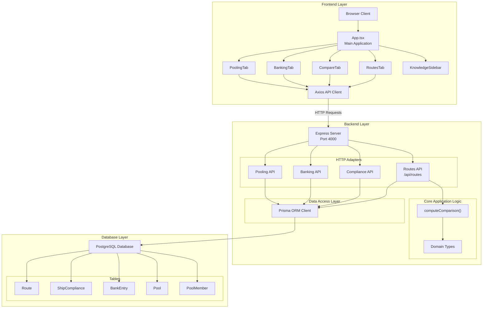
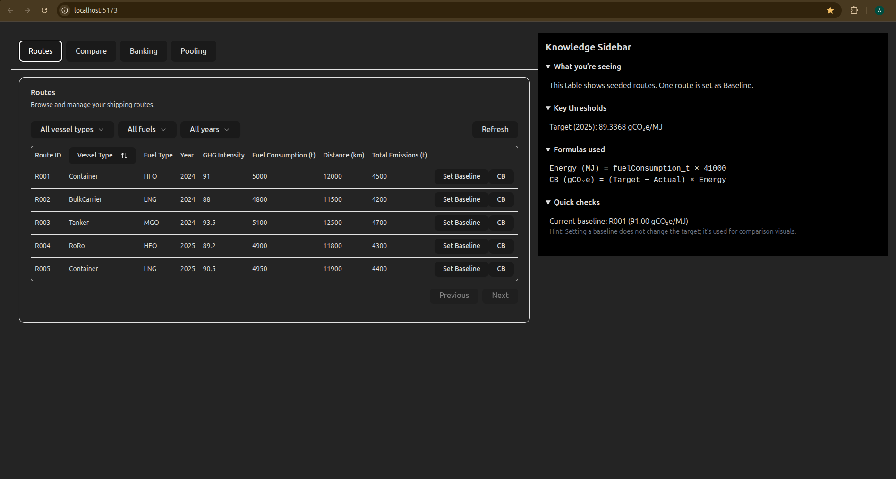
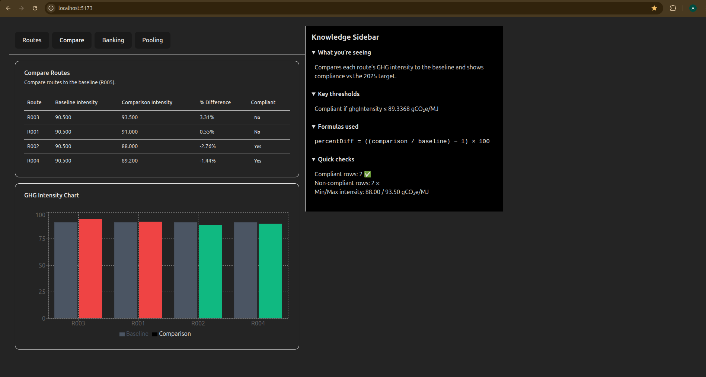
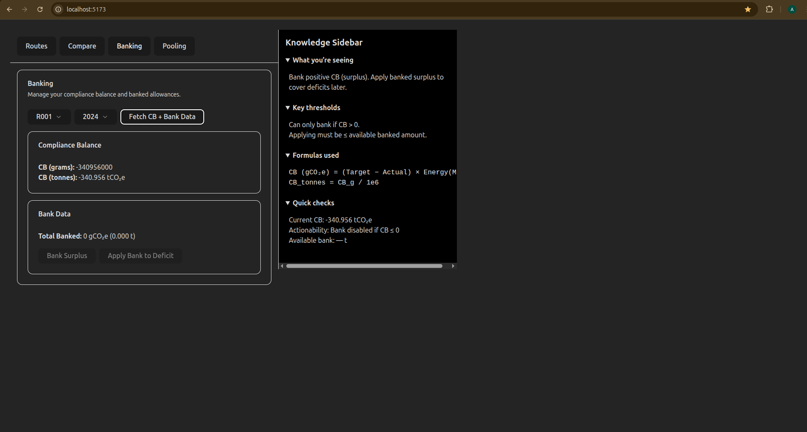
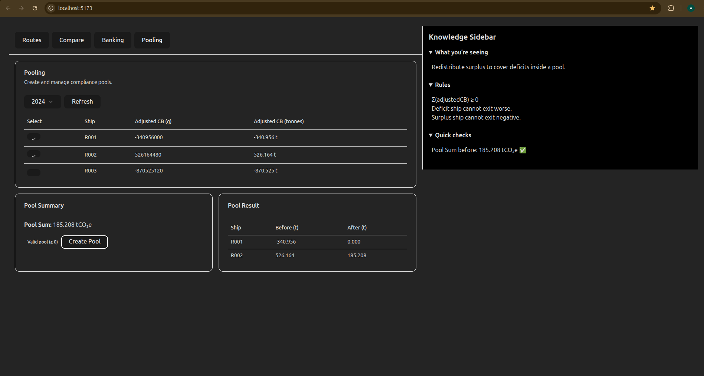

# FuelEU Maritime Compliance Platform

## Overview

This platform implements FuelEU Maritime regulation compliance logic for maritime operators. It calculates vessel emissions against regulatory targets, manages compliance balances, and provides mechanisms for banking surplus credits and pooling deficits across multiple vessels.

**Target Users:** Maritime companies, fleet operators, and compliance officers managing GHG emissions under FuelEU Maritime regulations.

---

## Architecture

The system uses Hexagonal Architecture (Ports and Adapters) to separate business logic from external dependencies.

### Why Hexagonal Architecture

- **core/domain**: Pure business logic (CB calculations, pooling algorithms) with no external dependencies
- **adapters**: Interface implementations (HTTP routes, database queries, UI components)
- **infrastructure**: Framework-specific code (Express server, Prisma client)

This separation allows testing core logic independently and swapping implementations without affecting business rules.

---
### System Architecture Diagram


---
### Directory Structure

```
backend/src/
├── core/
│ ├── domain/ # Types and domain models
│ ├── application/ # Business logic (computeCB, banking, pooling)
│ └── ports/ # Repository interfaces
├── adapters/
│ ├── inbound/http/ # Express route handlers
│ └── outbound/postgres/ # Prisma repository implementations
└── infrastructure/
├── db/ # Prisma client
└── server/ # Express app setup

frontend/
├── src/
│   ├── core/domain/         # Constants, types
│   ├── adapters/
│   │   ├── ui/tabs/         # Routes, Compare, Banking, Pooling tabs
│   │   └── infrastructure/  # API client
│   └── components/ui/       # Reusable UI components
└── tests/                   # Component tests
```

---

## Setup & Run

### Prerequisites

- Node.js v18+
- PostgreSQL

---

### Installation

**1. Clone repository:**
```bash
git clone <repository-url>
```

**2. Install backend dependencies:**
```bash
cd backend && npm install
```

**3. Install frontend dependencies:**
```bash
cd frontend && npm install
```

**4. Configure database:**
- Create PostgreSQL database
- Copy `backend/.env.example` to `backend/.env`
- Update `DATABASE_URL` with connection string

**5. Run migrations and seed data:**
```bash
cd backend
npx prisma migrate dev --name init
npx prisma db seed
```

---

### Running the Application

**Start backend (runs on port 4000):**
```bash
cd backend && npm run dev
```

**Start frontend (runs on port 5173):**
```bash
cd frontend && npm run dev
```

---

## Running Tests

**Backend tests:**
```bash
cd backend && npm test
```

**Frontend tests:**
```bash
cd frontend && npm test
```

---

## Compliance Formulas

### Energy Calculation

```
Energy (MJ) = fuelConsumption_t × 41,000 MJ/t
```

---

### Compliance Balance (CB)

```
CB_g = (TARGET_INTENSITY - actualIntensity) × Energy
CB_t = CB_g / 1,000,000
```

**Where:**
- `TARGET_INTENSITY` = 89.3368 gCO₂e/MJ (2025 target)
- `actualIntensity` = route's GHG intensity (gCO₂e/MJ)
- Positive CB = surplus (compliant)
- Negative CB = deficit (non-compliant)

---

### Percentage Difference (Route Comparison)

```
percentDiff = ((comparisonIntensity / baselineIntensity) - 1) × 100
compliant = (comparisonIntensity ≤ TARGET_INTENSITY)
```

---

## API Endpoints

### GET /api/routes

Retrieve all routes.

**Response:**
```json
[
  {
    "routeId": "R001",
    "vesselType": "Container",
    "fuelType": "HFO",
    "year": 2024,
    "ghgIntensity": 91.0,
    "fuelConsumption_t": 5000,
    "distance_km": 12000,
    "totalEmissions_t": 4500,
    "isBaseline": false
  }
]
```

---

### POST /api/routes/:routeId/baseline

Set a route as baseline for comparison.

**Request:**
```
POST /api/routes/R001/baseline
```

**Response:**
```json
{
  "routeId": "R001",
  "isBaseline": true,
  ...
}
```

---

### GET /api/routes/comparison

Compare all routes against the baseline.

**Response:**
```json
{
  "baseline": { "routeId": "R001", "ghgIntensity": 91.0, ... },
  "rows": [
    {
      "routeId": "R002",
      "baselineIntensity": 91.0,
      "comparisonIntensity": 88.0,
      "percentDiff": -3.30,
      "compliant": true
    }
  ]
}
```

---

### GET /api/compliance/cb?routeId=R001

Calculate compliance balance for a route.

**Response:**
```json
{
  "shipId": "R001",
  "year": 2024,
  "targetIntensity": 89.3368,
  "actualIntensity": 91.0,
  "energy_MJ": 205000000,
  "complianceBalance_gco2eq": -340956000
}
```

---

### POST /api/banking/bank

Bank surplus compliance balance.

**Request:**
```json
{
  "shipId": "R002",
  "year": 2024
}
```

**Response:**
```json
{
  "message": "Banked",
  "amount_banked": 150000000,
  "entry": { ... }
}
```

---

### POST /api/banking/apply

Apply banked credits to cover deficit.

**Request:**
```json
{
  "shipId": "R001",
  "year": 2024
}
```

**Response:**
```json
{
  "shipId": "R001",
  "year": 2024,
  "cb_before_g": -340956000,
  "applied_g": 150000000,
  "cb_after_g": -190956000,
  "remaining_bank_g": 0
}
```

---

### POST /api/pools

Create compliance pool with greedy redistribution algorithm.

**Request:**
```json
{
  "year": 2024,
  "members": [
    { "shipId": "R001", "cb_before_g": 200000000 },
    { "shipId": "R002", "cb_before_g": -150000000 }
  ]
}
```

**Response:**
```json
{
  "poolId": 1,
  "year": 2024,
  "members": [
    { "shipId": "R001", "cb_before": 200000000, "cb_after": 50000000 },
    { "shipId": "R002", "cb_before": -150000000, "cb_after": 0 }
  ]
}
```

---

## Feature Summary

| Tab | Purpose | Key Actions |
|-----|---------|-------------|
| **Routes** | View all vessel routes and set baseline | View routes, filter by vessel/fuel/year, set baseline, calculate CB |
| **Compare** | Compare routes against baseline | View percentage differences, check compliance status, visualize intensity chart |
| **Banking** | Manage surplus/deficit over time (Article 20) | Bank surplus CB, apply banked credits to deficits, view banking history |
| **Pooling** | Redistribute CB across vessels (Article 21) | Select pool members, validate pool sum ≥ 0, create pool with greedy algorithm |

---

## Screenshots
### Routes

Routes tab showing vessel data and baseline selection
### Compare Tab

Compare tab with baseline vs comparison chart
### Banking Tab

Banking tab with CB calculation and banking actions
### Pooling Tab

Pooling tab with member selection and pool creation

---

## Notes

The system implements core FuelEU Maritime compliance mechanisms: CB calculation, banking (temporal flexibility), and pooling (collective compliance). All formulas use `TARGET_INTENSITY_2025 = 89.3368 gCO₂e/MJ` and `MJ_PER_TON = 41,000`. The pooling algorithm uses a greedy approach to redistribute surplus to deficits, requiring total pool CB ≥ 0.